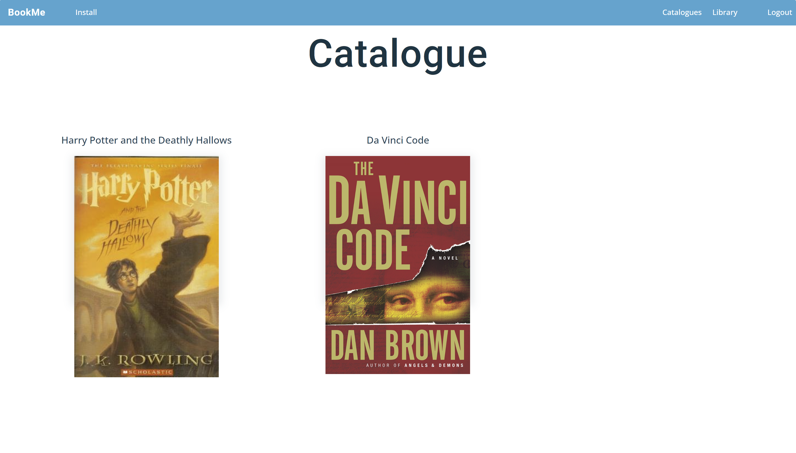
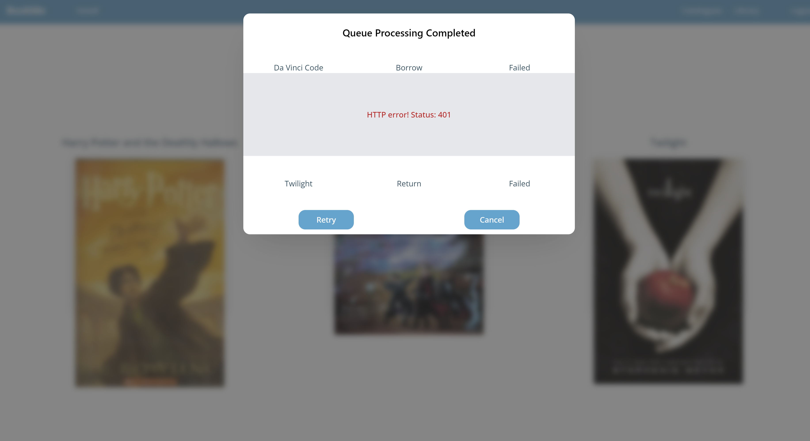

# BookMe

BookMe is a library simulation application with offline functionalities.

## Table of Contents

- [Introduction](#introduction)
- [Features](#features)
- [Prerequisites](#prerequisites)
- [Installation](#installation)
- [Usage Guide](#usage-guide)
- [Technical Stack](#technical-stack)
- [Challenges & Solutions](#challenges--solutions)
- [Future Enhancements](#future-enhancements)
- [Libraries and Packages](#libraries-and-packages)
- [License](#license)
- [Contact Information](#contact-information)

## Introduction

**BookMe** is more than just another project; it's a testament to my learning journey. I've always believed in the philosophy of "learning by doing." Historically, I crafted private projects to delve deep into new topics, but as I embarked on building a professional portfolio, I decided to pivot. I recognized the importance of not just acquiring skills but showcasing them as well. Hence, BookMe was born.

This application is an in-depth exploration into the world of Progressive Web Applications (PWAs). Designed to offer both a theoretical and hands-on approach, BookMe leverages [Create React App](https://reactjs.org/docs/create-a-new-react-app.html) and [Workbox](https://developers.google.com/web/tools/workbox) for its frontend PWA capabilities. But it doesn’t stop there. The app seamlessly integrates a [Laravel](https://laravel.com/) backend API and a [MySQL](https://www.mysql.com/) database, all encapsulated within [Docker](https://www.docker.com/) containers.

If you're passionate about modern web technologies or are just curious about how PWAs function in a full-stack environment, BookMe stands as a demonstration of the convergence of these tools. Welcome to my learning transformed into a tangible, functional project.

## Features

**BookMe** isn't just a learning project; it's a feature-rich application designed to emulate real-world scenarios in a library management system. Here's what users can do with BookMe:

### User Management:

- **Registration & Login:** New users can sign up and returning users can easily log in.
- **JWT Cookies:** Enhances security by using JSON Web Tokens for authentication.
- **Authorization:** Ensures that only permitted users can access certain functionalities.

### Library Navigation:

- **Browse the Library:** Users can view all the books available in the library.
- **Detailed View:** Dive deeper into any book's details with just a click.
- **Borrow a Book:** Found something interesting? Borrow it instantly.

### User's Catalogue:

- **Personal Collection:** Users can view all the books they've borrowed.
- **Detailed Book View:** Access more information about a borrowed book from the personal collection.

### Manage Borrowed Books:

- **Return a Book:** Done reading? Return it with ease.

### Offline Access and Actions Queue:

- **Offline Accessibility:** Users can still access cached pages even without an internet connection.
- **Action Queue:** Queue actions like borrowing and returning a book when offline.
- **Manage Queue:** View all the actions queued up and even remove some if needed.
- **Auto Execution:** Once back online, the queued actions automatically execute.

Whether online or offline, **BookMe** ensures users have a seamless and comprehensive library management experience.

## Prerequisites

Before delving into BookMe's rich features and functionalities, it's essential to ensure your system is equipped with the necessary tools and configurations. Here's a checklist to guide you through the prerequisites:

### Docker and Docker Compose:
- **Windows Users:** Ensure to [install Docker Desktop](https://www.docker.com/products/docker-desktop). Docker Desktop bundles Docker and Docker Compose together, offering a smooth setup experience for Windows users.
- **Server Users:** If deploying on a server, ensure both [Docker](https://docs.docker.com/get-docker/) and [Docker Compose](https://docs.docker.com/compose/install/) are installed and configured properly.

### Web Server with Certificates:
- Ensure you have a web server (such as [Nginx](https://www.nginx.com/) or [Apache](https://httpd.apache.org/)) set up if you intend to utilize HTTPS and custom domain names.
- Relevant SSL certificates must be in place to support HTTPS.

> **Note on Service Workers:** The PWA service workers within BookMe require HTTPS for secure and reliable functionality. While this isn't a concern for local development, it's paramount for server deployments to ensure that a web server with valid certificates is configured.

### Executing `.sh` scripts on Windows:
Windows users will need the ability to execute `.sh` scripts. Possible tools to achieve this include:
- [Git Bash](https://gitforwindows.org/)
- [WSL (Windows Subsystem for Linux)](https://docs.microsoft.com/en-us/windows/wsl/)
- [Cygwin](https://www.cygwin.com/)

### Git:
- Ensure [Git](https://git-scm.com/) is installed on your machine, which is vital for cloning the repository, managing versions, and handling project updates, irrespective of your operating system.

Ensure all these prerequisites are addressed to pave the way for a seamless and effective experience with BookMe.

## Installation

### Clone the Repository
Begin by cloning the BookMe repository into your desired directory using the following command in your terminal:
```bash
git clone [repository-url] BookMe
```

### Local Setup
For a hassle-free local setup, it's recommended to retain the default configurations. Access the application using localhost:[specified-port], e.g., http://localhost:8080.

### Docker Compose Configuration

Ensure you navigate to the appropriate directory and adjust the `docker-compose.yml` file according to your specific requirements.

#### Nginx Service

- **Port**: Default is `8080`. Modify as per your needs.

#### BookMe Database (bookme_db) Service

Configure the following variables as per your database setup:

- **MYSQL_DATABASE**: Ensure this name matches with the backend database name.
- **MYSQL_USER**: Must align with the backend-configured MySQL user.
- **MYSQL_PASSWORD**: Assign a secure password for the MySQL user.
- **MYSQL_ROOT_PASSWORD**: A strong password for the MySQL root user is recommended.
- **MYSQL_ALLOW_EMPTY_PASSWORD**: Default is 'no'. Enabling ('yes') can risk security.
- **MYSQL_RANDOM_ROOT_PASSWORD**: Set to 'yes' to generate a random root password and log it.

#### BookMe API (bookme_api) Service

Adjust variables as needed:

- **Port**: Default is `8081`.

**Database Configurations:**

- **IMAGE_PATH**: Define path to backend-stored images, e.g., `ip:port` or domain for nginx proxy and the path `/backend/storage/`. e.g. `http://localhost:8080/backend/storage/`
- **DB_DATABASE**: Specify the MySQL database name.
- **DB_USERNAME**: Define the MySQL username.
- **DB_PASSWORD**: Assign a secure password.

**JWT Configurations:**

- **JWT_SECRET**: A confidential string for JWT authentication.
- **JWT_ACCESS_TOKEN_LIFETIME**: Access token expiration (in minutes).
- **JWT_REFRESH_TOKEN_LIFETIME**: Refresh token expiration (in minutes).
- **JWT_AUTH_COOKIE**: Name your access token cookie.
- **JWT_AUTH_COOKIE_REFRESH**: Name your refresh token cookie.
- And further JWT configurations, adjust as necessary for secure authentication.

#### BookMe Frontend (bookme_frontend) Service

Ensure ports and paths are configured correctly:

- **Port**: Default is `3000`.

**Args:**

- **HOMEPAGE_URL**: Define the full URL of the frontend homepage.
- **REACT_APP_BACKEND_URL**: Set the full URL for the backend API.
- **REACT_APP_SUBPATH**: Specify the frontend's subpath.
- **REACT_APP_BACKEND_PATH**: Set the backend’s path.
- **REACT_APP_PROXY_PORT**: Define the port for the nginx server used in localhost redirects.
- **REACT_APP_PROXY_LOCALHOST**: Set to 'true' for localhost application, 'false' otherwise.
- **REACT_APP_BACKEND_IMAGE_PATH**: Path used by the service worker for caching backend images.

**Environment:**

- **REACT_APP_BACKEND_URL**: Assign the full URL for the backend API.
- **REACT_APP_BACKEND_PATH**: Define the backend's subpath.
- **REACT_APP_BACKEND_IMAGE_PATH**: Path used by the service worker for caching backend images.
- **REACT_APP_SUBPATH**: Specify the frontend’s subpath.

After ensuring all service variables are configured accurately, you can proceed with running your Docker containers. Check the sections above for running and managing your Docker services.


### Running The Containers
After configuring the services, start the containers using the following command:
```bash
docker compose up -d
```
Wait for Docker to finish setting up the containers. Once done, it's time to set up the database.

### Database Setup
Execute the migration_and_seed.sh script to run migrations, populate the database and create a symbolic link for public/storage to access the files:
```bash
./migration_and_seed.sh
```

Ensure you have the permissions to run the script. If not, you might need to make it executable with:

```bash
chmod +x migration_and_seed.sh
```

## Usage Guide

### 1. Landing Page
When you access the `bookme_frontend` URL, you'll be presented with a login screen.


### 2. Installable App Notice
On your first visit, a notification will appear:
- **Desktop Users**: Instructions on how to install the application on your desktop.
- **Mobile Users**: Information about the app's installability on your mobile device, with specific steps tailored for mobile installation. This application is mobile-responsive and offers a seamless user experience on smartphones.

  Once closed, this message won't reappear.


### 3. Login & Registration
You can log in using your existing credentials or opt to register as a new user.


### 4. User Catalogue
Upon successful login, your catalogue displaying books you've borrowed will appear.



### 5. Individual Book Details
Clicking on any book from your catalogue will reveal its details and an option to return it.


### 6. Library Navigation
Navigate to the library section via the navbar to view all available books.


### 7. Borrowing from Library
Choosing a book in the library shows its details and a borrowing option.


### 8. Data Caching
Service workers cache catalogue and library details for improved performance. Borrowing or returning a book refreshes this cache.

### 9. Offline Functionality
The application operates offline, with cached information accessible. Non-cached data will display an 'unable to fetch' message.
To test offline functionality while using localhost on desktop:
- Open the developer tools (You can open it using `F12` or right-click and select `Inspect`).
- Go to the `Network` tab.
- Find the `Online/Offline` toggle. Typically, it’s a dropdown saying `No throttling`.
- Click the dropdown and select `Offline`.

When borrowing or returning a book, please note that the caches are cleared. Therefore, while testing offline functionalities after performing these actions, the latest data may not be immediately available.


### 10. Action Queuing while Offline
Offline actions like borrowing or returning get queued. View this queue by pressing the "show queue" button.


### 11. Queue Management
Inside the queue, observe actions set for execution and remove any if needed.


### 12. Online Sync of Queued Actions
On regaining online access, the queued actions process. They might succeed or fail. Failures offer a detailed view for understanding and retrying.




## Technical Stack

The **BookMe** project is built on a comprehensive technical stack, showcasing a blend of frontend and backend technologies along with containerization for development environments. Below are the primary components:

### Frontend:

- **Create React App (CRA):**
  A popular toolchain for setting up and developing React applications. It provides a comfortable developer experience without the need to configure Webpack or Babel from scratch.

- **Workbox:**
  An extensive set of libraries and Node modules that make it easy to cache assets and take full advantage of features used to build Progressive Web Apps. This ensures the application is reliable and fast even in uncertain network conditions.

### Backend:

- **Laravel:**
  A robust PHP web application framework with expressive, elegant syntax. Laravel attempts to take the pain out of development by easing common tasks used in many web projects, such as authentication, routing, sessions, and caching.

### Containerization & Deployment:

- **Docker:**
  An open platform for developing, shipping, and running applications. Docker enables the application to work in a consistent environment, thereby reducing the "it works on my machine" problem.

- **Frontend and Backend Services:**
  Both frontend and backend are dockerized for a consistent and isolated development and deployment experience.

- **Nginx Container:**
  A high-performance HTTP server container used for serving the frontend and as a reverse proxy for the backend service.

- **MySQL Container:**
  The chosen relational database to store the application data.

This project wasn't just about building something functional; it was a journey of self-improvement, of expanding horizons and engaging with the broader spectrum of web development tools.

## Challenges & Solutions

Embarking on this project was not only about applying my existing skills but also confronting and overcoming challenges that expanded my understanding of web development. Here's a glimpse into some hurdles I encountered and how I navigated through them:

### Service Workers and Progressive Web Apps (PWAs):

- **Challenge:** My innate curiosity always pushes me to delve deep into the underlying mechanics of a technology. As a novice to PWAs and service workers, comprehending their intricate details was daunting.

- **Solution:** Dedicating time to robust documentation, community resources and utilizing AI Chatbot technologies provided the clarity I needed. Although the learning curve was steep, grasping the fundamental workings of service workers opened up a new dimension of possibilities for me.

### Browser Discrepancies:

- **Challenge:** An unexpected difference in behavior between desktop and mobile browsers caught me off-guard, especially when the service worker's functionality on desktop seemed flawless.

- **Solution:** After extensive debugging and research, I discerned the nuances between the two platforms. Recognizing their distinct behaviors enabled me to adapt my approach, ensuring uniformity across devices.

### Dockerization & Deployment:

- **Challenge:** Translating a working development environment into a flawless production setup within containers posed its unique set of obstacles. Constructing Dockerfiles, orchestrating with Docker Compose, and configuring Nginx required meticulous attention to detail.

- **Solution:** Delving into Docker documentation and iterative testing helped me iron out the kinks. The experience enriched my understanding of containers, how they interact, and the nuances of deploying applications using Docker.

### Versatility in Deployment Environments:

- **Challenge:** Ensuring the application's seamless operation, be it on a dedicated server or locally via Docker Desktop, presented its own set of complexities.

- **Solution:** Fostering a modular configuration strategy, I made provisions for environment-specific settings. This flexibility guaranteed the application's adaptability regardless of its host environment.

These challenges didn't deter me; instead, they became opportunities for growth. Every hurdle reinforced the importance of perseverance, continuous learning, and the vast expanse of knowledge yet to be explored in the tech realm.

## Future Enhancements

While the primary objective of this project was to gain a foundational understanding of Progressive Web Applications (PWAs), the realm of web development is ever-evolving. The landscape continuously shifts with the emergence of innovative techniques, methodologies, and tools.

As I embark on my journey of continuous learning and professional growth, I see this project as a potential canvas. It stands as a testament to my commitment to evolve with the times and assimilate new knowledge. Although its current iteration has achieved its initial goals, I anticipate revisiting and refining this project as I encounter new technologies and practices.

In essence, this project may transform and adapt, mirroring my own journey of discovery and mastery in the world of web development.

## Libraries and Packages

This project has been made possible with the integration and utilization of various libraries and packages. Here's a breakdown of the major ones used:

### Frontend (React)
- **Axios**: A promise-based HTTP client for making asynchronous network requests.
- **TypeScript**: A strongly typed superset of JavaScript that adds optional static typing.
- **React-Spinners**: A collection of loading spinners with React.js based on Halogen.
- **Workbox**: A set of libraries and Node modules that make it easy to cache assets and take full advantage of features used to build Progressive Web Apps.
- **Tailwind**: A utility-first CSS framework for rapidly building custom user interfaces.

### Backend (Laravel)
- **firebase/php-jwt**: A simple library to encode and decode JSON Web Tokens (JWT) in PHP, conforming to RFC 7519.

## License

This project is licensed under the MIT License - see the [LICENSE](LICENSE)

## Contact Information

If you have any questions about this project or would like to discuss other potential collaboration opportunities, feel free to reach out:

- **Name**: Dillon Raymond
- **Email**: dillonkraywork@gmail.com
- **LinkedIn**: https://www.linkedin.com/in/dkraymond/

